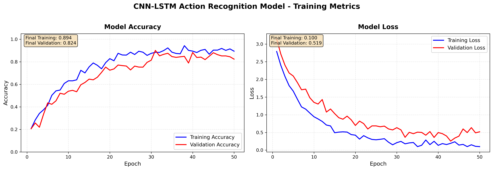
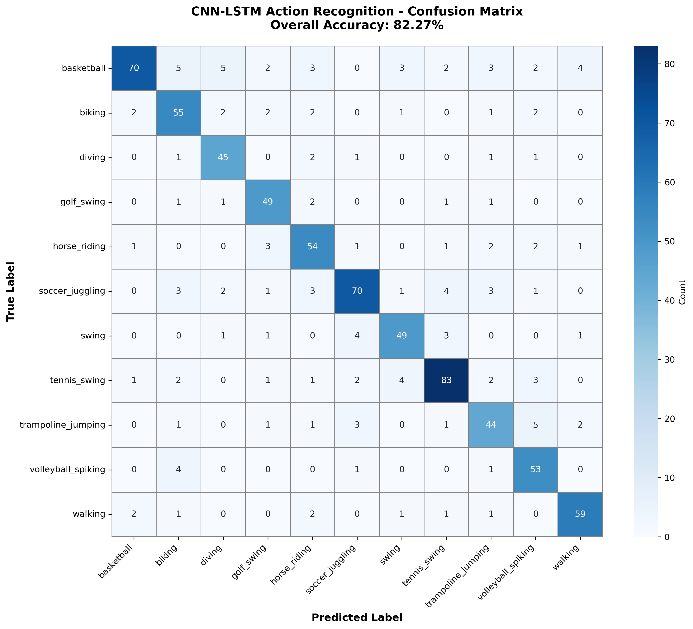

# 🎬 Human Activity Recognition System

> **An intelligent deep learning solution for video-based human action classification using hybrid CNN-LSTM architecture**

[](https://python.org)
[](https://tensorflow.org)
[](https://flask.palletsprojects.com)
[](LICENSE)

---

## 📋 Table of Contents

- [Overview](#-overview)
- [Key Features](#-key-features)
- [Model Architecture](#-model-architecture)
- [Dataset Information](#-dataset-information)
- [Performance Metrics](#-performance-metrics)
- [Quick Start Guide](#-quick-start-guide)
- [API Documentation](#-api-documentation)
- [Project Layout](#-project-layout)
- [Technical Implementation](#-technical-implementation)
- [Future Enhancements](#-future-enhancements)

---

## 🎯 Overview

This **Human Activity Recognition System** is a sophisticated deep learning solution that leverages convolutional neural networks combined with LSTM recurrent architectures to understand and classify human activities in video sequences. The system processes temporal information across multiple frames, enabling accurate recognition of complex motion patterns and human actions.

### Why This Approach?

Traditional image classifiers analyze single frames independently, missing crucial temporal dynamics. Our hybrid architecture addresses this limitation:

```
Single Frame Analysis → Limited context, no motion understanding
Sequence Analysis     → Full temporal context, motion patterns captured
```

---

## ✨ Key Features

| Feature | Description |
|---------|-------------|
| 🧠 **Hybrid Architecture** | Combines spatial feature extraction with temporal sequence modeling |
| 🚀 **Real-time Processing** | Optimized inference pipeline for quick predictions |
| 🌐 **REST API** | Clean, well-documented endpoints for easy integration |
| 🎨 **Modern Web Interface** | Intuitive drag-and-drop video upload with live preview |
| 📊 **Detailed Analytics** | Probability distributions across all activity classes |
| 📱 **Responsive Design** | Works seamlessly on desktop and mobile devices |

---

## 🏗️ Model Architecture

Our recognition pipeline employs a two-stage feature extraction approach:

### Architectural Overview

```
┌─────────────────────────────────────────────────────────────────┐
│                    INPUT LAYER                                  │
│              (20 frames × 224 × 224 × 3)                       │
└─────────────────────────┬───────────────────────────────────────┘
                          │
                          ▼
┌─────────────────────────────────────────────────────────────────┐
│              SPATIAL FEATURE EXTRACTOR                          │
│         TimeDistributed(MobileNetV2)                            │
│    ─────────────────────────────────────                       │
│    • Pre-trained on ImageNet (1000 classes)                    │
│    • Global Average Pooling output                             │
│    • Processes each frame independently                         │
│    • Output: 20 × 1280 feature vectors                         │
└─────────────────────────┬───────────────────────────────────────┘
                          │
                          ▼
┌─────────────────────────────────────────────────────────────────┐
│              TEMPORAL SEQUENCE LEARNER                          │
│                    LSTM (64 units)                              │
│    ─────────────────────────────────────                       │
│    • Captures motion dynamics across frames                     │
│    • Learns temporal dependencies                               │
│    • Output: 64-dimensional context vector                      │
└─────────────────────────┬───────────────────────────────────────┘
                          │
                          ▼
┌─────────────────────────────────────────────────────────────────┐
│              REGULARIZATION LAYER                               │
│                  Dropout (p=0.5)                                │
│    ─────────────────────────────────────                       │
│    • Prevents overfitting during training                       │
│    • Disabled during inference                                  │
└─────────────────────────┬───────────────────────────────────────┘
                          │
                          ▼
┌─────────────────────────────────────────────────────────────────┐
│              CLASSIFICATION HEAD                                │
│              Dense(11, softmax)                                 │
│    ─────────────────────────────────────                       │
│    • Multi-class probability distribution                       │
│    • 11 activity categories                                     │
└─────────────────────────────────────────────────────────────────┘
```

### Component Details

| Component | Specification | Purpose |
|-----------|---------------|---------|
| **Backbone CNN** | MobileNetV2 (ImageNet weights) | Efficient spatial feature extraction |
| **Temporal Module** | LSTM with 64 hidden units | Learning frame-to-frame relationships |
| **Dropout Rate** | 50% | Regularization to improve generalization |
| **Activation** | Softmax | Probability distribution over classes |

---

## 📁 Dataset Information

The model is trained and evaluated on the **UCF11 YouTube Actions** dataset, a benchmark for human action recognition research.

### Supported Activity Categories

| Category | Description | Example Motions |
|----------|-------------|-----------------|
| 🏀 **Basketball** | Basketball shooting | Dribbling, shooting, jumping |
| 🚴 **Biking** | Bicycle riding | Pedaling, steering |
| 🏊 **Diving** | Platform/springboard diving | Approach, takeoff, rotation |
| ⛳ **Golf Swing** | Golf club swinging | Backswing, downswing, follow-through |
| 🐴 **Horse Riding** | Equestrian activities | Trotting, galloping, jumping |
| ⚽ **Soccer Juggling** | Keeping ball airborne | Foot, knee, head touches |
| 🎪 **Swing** | Playground swinging | Forward-backward oscillation |
| 🎾 **Tennis Swing** | Tennis strokes | Forehand, backhand, serve |
| 🤸 **Trampoline Jumping** | Trampoline bouncing | Various aerial maneuvers |
| 🏐 **Volleyball Spiking** | Volleyball attack | Approach, jump, spike |
| 🚶 **Walking** | Human locomotion | Forward walking motion |

---

## 📈 Performance Metrics

### Training Progress Visualization



*Figure 1: Training and validation accuracy/loss curves over epochs*

### Classification Performance



*Figure 2: Confusion matrix showing per-class prediction accuracy*

---

## 🚀 Quick Start Guide

### Prerequisites

Ensure you have the following installed:
- Python 3.8 or higher
- pip package manager
- FFmpeg (for video processing)

### Step 1: Clone & Navigate

```bash
# Clone the repository
git clone <repository-url>
cd DLAssignment
```

### Step 2: Install Dependencies

```bash
# Navigate to backend directory
cd backend

# Install required packages
pip install -r requirements.txt
```

### Step 3: Launch the Server

```bash
# Start the API server
python app.py
```

You should see:
```
╔══════════════════════════════════════════════════════════════╗
║      Human Activity Recognition - REST API Server           ║
╠══════════════════════════════════════════════════════════════╣
║  Status     : Active                                         ║
║  Endpoint   : http://127.0.0.1:5000                         ║
║  Categories : 11 activity classes                            ║
╚══════════════════════════════════════════════════════════════╝
```

### Step 4: Open the Interface

Open `frontend/index.html` in your web browser to access the interactive interface.

---

## 📡 API Documentation

### Base URL
```
http://127.0.0.1:5000
```

### Endpoints

#### Health Check
```http
GET /
```
Returns server status and available endpoints.

**Response:**
```json
{
    "status": "operational",
    "service": "Human Activity Recognition API",
    "model_info": {
        "architecture": "CNN-LSTM Hybrid",
        "categories": 11
    }
}
```

#### Get Activity Categories
```http
GET /categories
```
Returns list of recognizable activities.

**Response:**
```json
{
    "categories": ["basketball", "biking", ...],
    "total": 11
}
```

#### Analyze Video
```http
POST /predict
Content-Type: multipart/form-data
```

| Parameter | Type | Required | Description |
|-----------|------|----------|-------------|
| `video` | file | Yes | Video file (MP4, AVI, MOV, etc.) |

**Success Response (200):**
```json
{
    "success": true,
    "prediction": {
        "activity": "basketball",
        "confidence": 94.67,
        "category_index": 0
    },
    "probability_distribution": {
        "basketball": 0.9467,
        "biking": 0.0234,
        ...
    }
}
```

**Error Response (400):**
```json
{
    "success": false,
    "error": "invalid_format",
    "message": "Unsupported video format. Please use MP4, AVI, or MOV."
}
```

---

## 📂 Project Layout

```
DLAssignment/
│
├── 📁 backend/                    # Server-side components
│   ├── app.py                     # Flask REST API application
│   ├── model_loader.py            # Neural network initialization
│   ├── video_utils.py             # Video preprocessing pipeline
│   └── requirements.txt           # Python dependencies
│
├── 📁 frontend/                   # Client-side interface
│   ├── index.html                 # Main application page
│   ├── style.css                  # Visual styling
│   └── script.js                  # Interactive functionality
│
├── 📁 models/                     # Trained model artifacts
│   ├── ucf11_cnn_lstm_model.h5   # Serialized model weights
│   └── classes.json               # Category label mapping
│
├── 📁 plots/                      # Training visualizations
│   ├── accuracy_loss.png          # Learning curves
│   └── confusion_matrix.png       # Classification report
│
└── 📄 README.md                   # Project documentation
```

---

## 🔧 Technical Implementation

### Video Processing Pipeline

```python
# Preprocessing flow for each video
Video File
    │
    ├──► Frame Extraction (20 frames, uniform sampling)
    │
    ├──► Spatial Resizing (224 × 224 pixels)
    │
    ├──► Color Normalization ([0, 255] → [0, 1])
    │
    ├──► Batch Dimension Addition
    │
    └──► Model Input: (1, 20, 224, 224, 3)
```

### Key Design Decisions

1. **MobileNetV2 Backbone**: Chosen for its excellent accuracy-to-computation ratio, enabling faster inference without significant accuracy loss.

2. **Fixed Sequence Length**: 20 frames provide sufficient temporal context while maintaining computational efficiency.

3. **Transfer Learning**: ImageNet pre-training provides robust low-level feature extractors, reducing training data requirements.

4. **LSTM over GRU**: Selected for its superior performance on longer sequences due to separate memory cell architecture.

---

## 🔮 Future Enhancements

- [ ] **Attention Mechanisms**: Implement temporal attention for focusing on key frames
- [ ] **Multi-Scale Processing**: Process videos at multiple temporal resolutions
- [ ] **Real-Time Streaming**: Enable webcam input for live activity recognition
- [ ] **Model Optimization**: TensorFlow Lite conversion for mobile deployment
- [ ] **Extended Dataset**: Training on UCF101 for broader activity coverage

---

## 📄 License

This project is developed for educational purposes as part of a Deep Learning course assignment.

---

<div align="center">

**Built with ❤️ using TensorFlow & Flask**

*Deep Learning Assignment - Human Activity Recognition using CNN-LSTM*

</div>

## Sample Test Videos

Download sample videos from UCF11 dataset to test:
- [UCF11 Dataset](https://www.crcv.ucf.edu/data/UCF_YouTube_Action.php)

Or use any short video (MP4/AVI) showing these actions:
- Basketball, Biking, Diving, Golf, Horse Riding
- Soccer Juggling, Swing, Tennis, Trampoline, Volleyball, Walking

## Tech Stack

- TensorFlow/Keras
- MobileNetV2 (ImageNet pretrained)
- Flask REST API
- ImageIO, OpenCV

## Dataset

[UCF11 - YouTube Action Dataset](https://www.crcv.ucf.edu/data/UCF_YouTube_Action.php)


